# 📚 BookFlow – Flutter app for speed reading

BookFlow is an innovative Flutter application designed to help users read faster using the **Spritz** technique — a word-at-a-time reading experience optimized for focus and speed.

---

## 🚀 Features

- 🎬 Custom animated Splash Screen
- 👋 Welcome Screen with rich animations
- 🔐 Authentication:
  - Sign up / Sign in with Google
  - Sign in with Apple
  - Sign up via Email (multi-step flow)
  - Forgot password flow
- 📖 Main Reading Screen ("Reading Now")
- 🗂 Library Screen:
  - Book lists and collections
  - Book filtering & sorting
  - Add books via FilePicker
- 🙍‍♂️ Profile Screen:
  - User stats (placeholder)
  - Personal information
- ⚙️ Settings Screen:
  - Toggle light/dark theme
  - Update profile data
- 🧠 Smart Reading Experience (Spritz-style):
  - Landscape-only immersive reading mode
  - Swipe gestures to control WPM (words per minute)
  - Swipe to navigate reading progress
  - Customizable reading themes, fonts, and backgrounds
  - Smooth animations for a premium feel
  - All preferences saved via app state

---

## 💡 Tech Stack

- **Flutter & Dart**
- **State Management:** Provider, Bloc
- **Firebase Auth**
- **FilePicker plugin**
- **Custom UI animations & transitions**

---

## 🧩 Project Structure (simplified)

---

## 📸 Screenshots & GIF Previews

Experience BookFlow in action through these short UI demos.

---

### 🔥 Splash & Welcome

| Splash Screen | Welcome Screen |
|---------------|----------------|
| 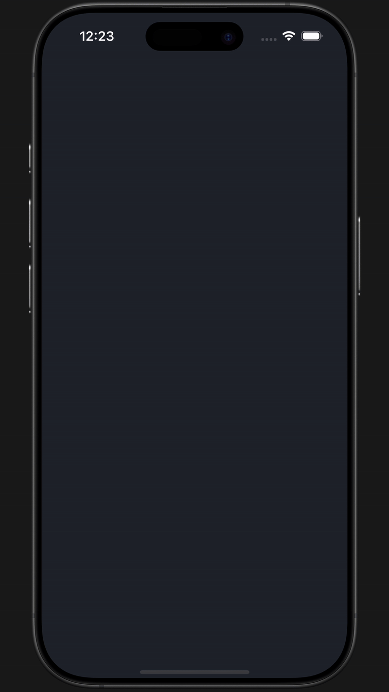 |  |

---

### 🔐 Authentication Flow

| Sign Up | Log In | Forgot Password |
|--------|--------|-----------------|
| 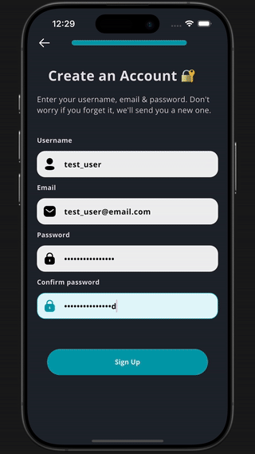 | 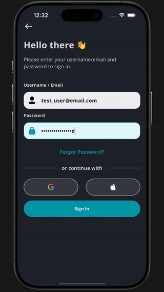 | 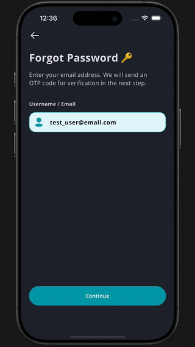 |

---

### 📖 Library & Book Management

| Reading Now | Add to Collection | Add New Book |
|-------------|-------------------|---------------|
| 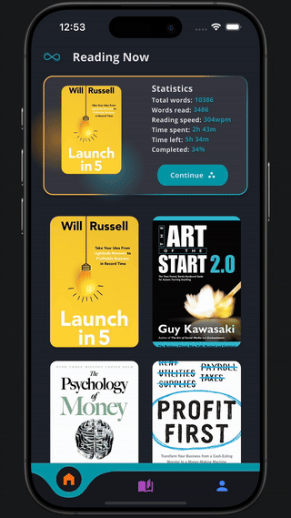 | 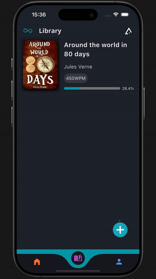 | 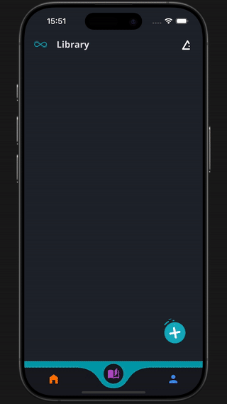 |

---

### 🧭 App Experience

| Mode Switch (Light/Dark) | Personal Info | Logout |
|--------|----------------|---------------------------|
|  | 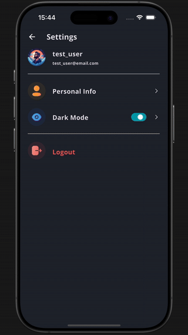 | 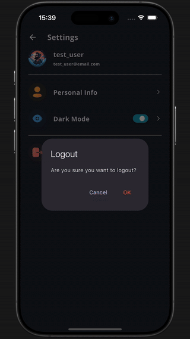 |

---

## 📖 Reader Screen

Explore the immersive reading experience powered by Spritz — optimized for focus, speed, and customization.

---

### 📲 Open Reader Screen  
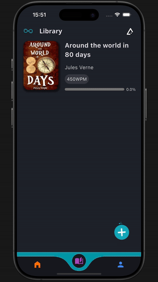

---

### 🟢 Start Reading  
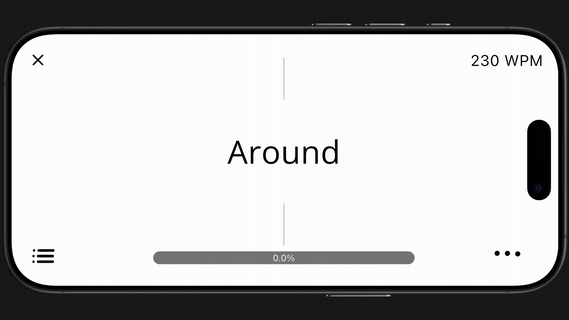

---

### 🕐 Change Speed (WPM)  
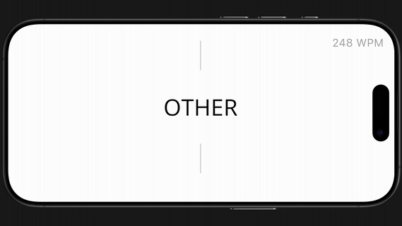

---

### 📍 Navigate Through Book  
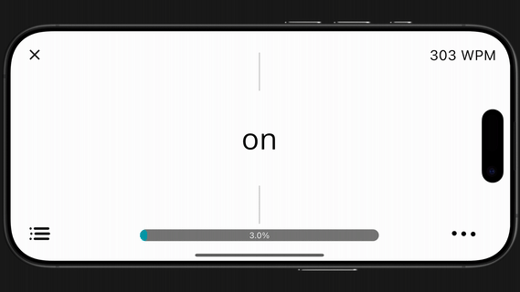

---

### 🎨 Theme Switch (Light / Dark Modes)

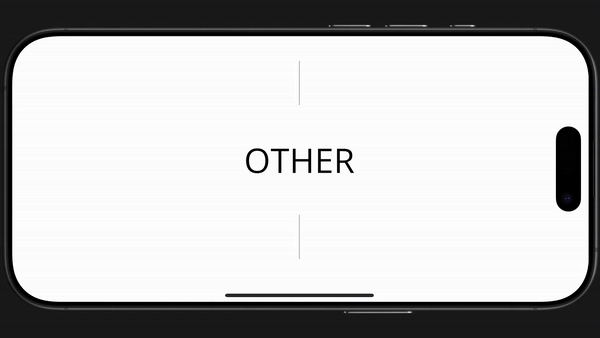

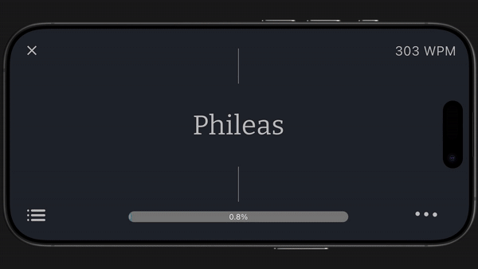

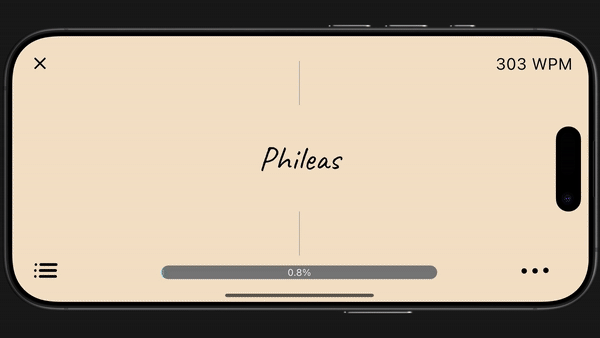

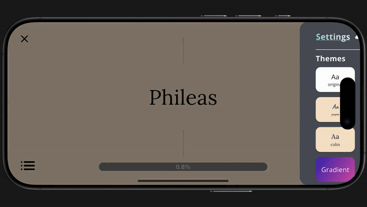

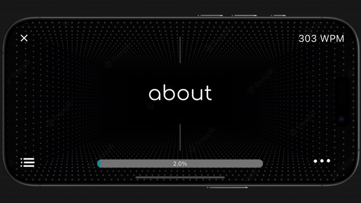

---

### 🔤 Change Font  
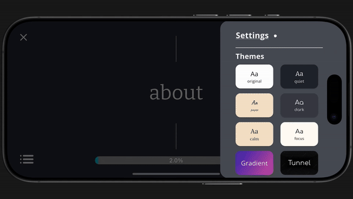

---

_🎥 For full experience, check out the [demo video](https://youtu.be/8kCLanLIhLU)_

## 🧠 What I Did

- Developed full frontend architecture using Flutter
- Integrated Firebase Authentication (Google, Apple, Email)
- Implemented Spritz-based speed reading display
- Designed and built UI/UX for all screens
- Used Provider & Bloc for clean state management
- Worked with file uploads, sorting logic, user preferences
- Modularized and documented codebase
- Created immersive, landscape-only reading screen using Spritz method
- Built advanced gesture controls for reading speed and navigation
- Added customizable themes, fonts, and backgrounds
- Ensured persistent state management for user preferences
- Designed animated UI for smooth, intuitive user experience

---

## 📚 Future Plans

- Add real stats and reading progress
- Refactor to use Riverpod or Cubit
- Connect to backend for syncing book data
- Publish on Play Store and App Store

---

## 🔗 Links

- 🧠 GitHub Repo: [this repo]
- 📽 Demo video: _coming soon_

