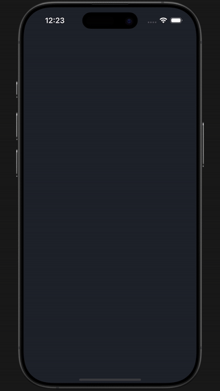

# 📚 BookFlow – Flutter app for speed reading

BookFlow is an innovative Flutter application designed to help users read faster using the **Spritz** technique — a word-at-a-time reading experience optimized for focus and speed.

---

## 🚀 Features

- 🎬 Custom animated Splash Screen
- 👋 Welcome Screen with rich animations
- 🔐 Authentication:
  - Sign up / Sign in with Google
  - Sign in with Apple
  - Sign up via Email (multi-step flow)
  - Forgot password flow
- 📖 Main Reading Screen ("Reading Now")
- 🗂 Library Screen:
  - Book lists and collections
  - Book filtering & sorting
  - Add books via FilePicker
- 🙍‍♂️ Profile Screen:
  - User stats (placeholder)
  - Personal information
- ⚙️ Settings Screen:
  - Toggle light/dark theme
  - Update profile data
- 🧠 Smart Reading Experience (Spritz-style):
  - Landscape-only immersive reading mode
  - Swipe gestures to control WPM (words per minute)
  - Swipe to navigate reading progress
  - Customizable reading themes, fonts, and backgrounds
  - Smooth animations for a premium feel
  - All preferences saved via app state


---

## 💡 Tech Stack

- **Language:** Dart
- **Framework:** Flutter
- **State Management:** Provider, Bloc
- **Authentication:** Firebase Auth, Sign in with Google & Apple
- **Animations:** Flutter built-in animations, Hero transitions, AnimatedContainer, Custom UI animations & transitions
- **File Handling:** FilePicker plugin (for importing books)
- **Theming:** Light/Dark theme switch, dynamic theming with Bloc
- **Routing:** Navigator 2.0 
- **Architecture:** Modular folder structure, separation of concerns
- **Responsive UI:** MediaQuery & LayoutBuilder-based scaling
- **Platform:** Android and iOS-ready (with iOS sign-in support)

---

## 💼 Project Role

Solo Flutter Developer — from UI design in Figma to complete frontend implementation.  
10-month build of a real startup MVP prototype with Firebase Auth, advanced UI, and full UX polish.  

---

## 🧩 Project Structure (simplified)

The project follows a modular architecture for clarity and scalability:

- `bloc/` — All business logic and state management (organized by feature)
- `core/` — Constants, shared utilities, and exports
- `presentation/` — UI screens grouped by purpose and flow
- `repository/` — Data access and authentication abstraction
- `routes/` — Centralized route definitions
- `theme/` — App-wide styles, fonts, and decorations
- `exceptions/` — Custom error handling
- `main.dart` — App entry point
- `firebase_options.dart` — Firebase initialization

```
lib/
├── main.dart
├── firebase_options.dart
├── bloc/
│   ├── authentification/
│   ├── personal_settings/
│   ├── signup/
│   ├── theloop_theme/
│   └── themecubit/
├── core/
│   ├── app_export.dart
│   ├── constants/
│   └── utils/
├── exceptions/
│   └── custom_exception.dart
├── presentation/
│   ├── splash_screen/
│   ├── welcome_screen/
│   ├── login_and_registration_screens/
│   ├── _Feature_otp_code_verification_screen/
│   ├── app_navigation_screen/
│   ├── home_screen/
│   ├── library_screen/
│   ├── the_loop_screen/
│   ├── profile_screen/
│   ├── settings_screen/
│   ├── settings_personal_info_screen/
│   └── widgets/
├── repository/
│   └── auth_repository.dart
├── routes/
│   └── app_routes.dart
└── theme/
    ├── app_decoration.dart
    ├── app_style.dart
    └── fonts.dart
```


---

## 📸 Screenshots & GIF Previews

Experience BookFlow in action through these short UI demos.

---

### 🔥 Splash & Welcome

| Splash Screen | Welcome Screen |
|---------------|----------------|
|  |  |

---

### 🔐 Authentication Flow

| Sign Up | Log In | Forgot Password |
|--------|--------|-----------------|
|  |  |  |

---

### 📖 Library & Book Management

| Reading Now | Add to Collection | Add New Book |
|-------------|-------------------|---------------|
|  |  |  |

---

### 🧭 App Experience

| Mode Switch (Light/Dark) | Personal Info | Logout |
|--------|----------------|---------------------------|
|  |  |  |

---

## 📖 Reader Screen

Explore the immersive reading experience powered by Spritz — optimized for focus, speed, and customization.

---

### 📲 Open Reader Screen  


---

### 🟢 Start Reading  


---

### 🕐 Change Speed (WPM)  


---

### 📍 Navigate Through Book  


---

### 🎨 Theme Switch (Light / Dark Modes)


---

### 🔤 Change Font  


---

_🎥 For full experience, check out the [demo video](https://youtu.be/8kCLanLIhLU)_


## 🧠 What I Did

- Developed full frontend architecture using Flutter
- Integrated Firebase Authentication (Google, Apple, Email)
- Implemented Spritz-based speed reading display
- Designed and built UI/UX for all screens in Figma
- Used Provider & Bloc for clean state management
- Worked with file uploads, sorting logic, user preferences
- Modularized and documented codebase
- Created immersive, landscape-only reading screen using Spritz method
- Built advanced gesture controls for reading speed and navigation
- Added customizable themes, fonts, and backgrounds
- Ensured persistent state management for user preferences
- Designed animated UI for smooth, intuitive user experience


---

## 📚 Future Plans

- Add real stats and reading progress
- Connect to backend for syncing book data
- Publish on Play Store and App Store

---

## 🔗 Links

- 🧠 GitHub Repo: [github.com/Kobbleton/bookflow](https://github.com/Kobbleton/bookflow)
- 📽 Demo video: [YouTube](https://youtu.be/8kCLanLIhLU)


